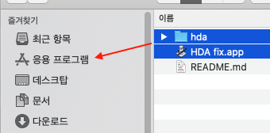
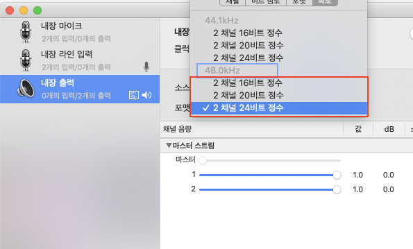

# 내장 스피커/이어폰 잭 픽스
# Built-in speaker/Earphone jack fix

### 1단계/Step 1

- hda폴더와 HDA fix.app을 다운받아 /Applications 에 넣어줍니다. 

- Download the hda folder and HDA fix.app and put them in /Applications.

### 2단계/Step 2

- 시스템 환경설정→사용자 및 그룹→로그인 항목에서 +를 눌러 HDA fix.app을 추가합니다. 

- System Preferences→Users & Groups→Login Items, press + to add HDA fix.app.

### 3단계/Step 3

- 재부팅을 하거나 HDA fix.app을 실행합니다. 

- Reboot or run HDA fix.app.

### 4단계/Step 4

- 오디오 MIDI 설정 앱을 열어 내장 출력의 포맷을 48.0kHz로 변경하면 내장 스피커의 금속성 잡음이 사라집니다. 

- Open the Audio MIDI Settings app and change the format of the built-in output to 48.0kHz and the metallic noise from the built-in speaker will disappear.
