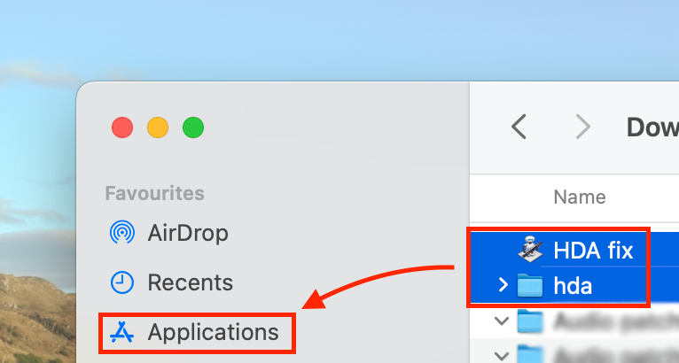
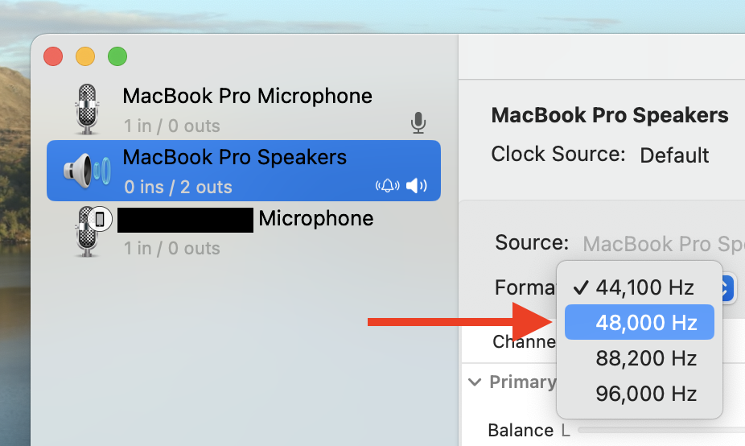

# Integrated Speaker/Audio jack fix

1. Download [hda folder](https://download-directory.github.io/?url=https://github.com/rainbowicenow/Galaxy-Book-Ion-Hackintosh/tree/master/Audio%20patch/hda) and [HDA fix.app](https://download-directory.github.io/?url=https://github.com/rainbowicenow/Galaxy-Book-Ion-Hackintosh/tree/master/Audio%20patch/HDA%20fix.app) then move to /Applications folder.
2. Add HDA fix.app to Login Items at `System Settings → General → Login Items`.
3. Restart or start HDA fix.app

4. Change speaker's format to 48,000 Hz at Audio MIDI Setup application to remove static noise from speaker.

### See also
* https://bugs.launchpad.net/ubuntu/+source/linux/+bug/1851518
* https://github.com/tkrotoff/Gigabyte-GA-Z77-DS3H-rev1.1-Hackintosh/issues/3
